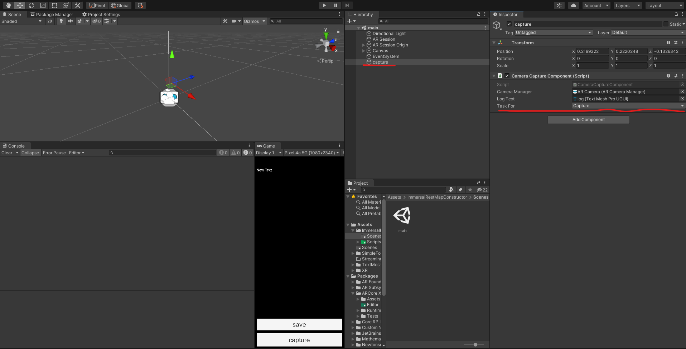
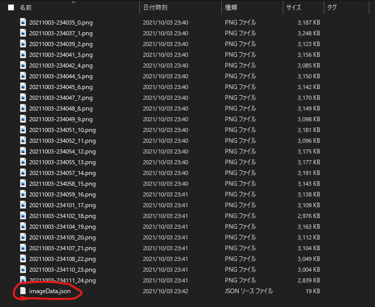
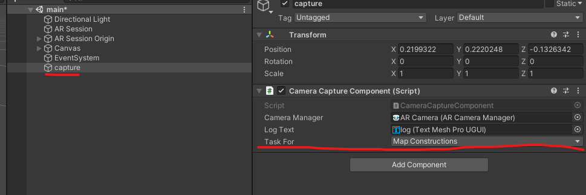

# Immersalマップつくる君β

## About

Immersalマップつくる君βです。  
ARFoundationとImmersal REST APIを使ってImmersalのマップを作ることができます。

公式のMapperと比べて以下のようなメリットがあります。

- オフラインでスキャンすることができる
  - 通信料を心配する必要がなく、そもそも電波が悪い場所でスキャンができない問題を解決する
- スキャンデータを手元で確認することができる

個人利用で満足してしまっていて仕様が奇怪かもしれないので、
良い案があればdiscussionやissueで教えてもらえると嬉しいです。

## Tested Environment

- Windows10 Home
- Google Pixel 4a 5G
- Unity 2020.3.11f1
- ARFoundation 4.1.7
- UniTask 2.2.5

## Usage

マップを作成するには2つの工程があります。

### 1. スキャン

`Assets/ImmersalRestMapConstructor/Scenes/main.unity`というシーンを開きます。
`ImmersalCaptureComponent`というコンポーネントのTask Forという値が
`Capture`になっていることを確認し、モバイル向けにビルドします。

uGUIが雑なので端末によって調整が必要かもしれないです。



ビルドして実行するときに、
画面一番下のcaptureボタンを押して画像をキャプチャしていき、
一通りマップ用の画像を収集出来たらsaveボタンを押します。

### 2. マップ作成

1.の工程が終わったらスマホをPCに繋ぎ、
ストレージからキャプチャデータを回収します。
キャプチャデータはスマホの`Application.persistantDataPath`に保存されています。
スマホからデータが回収出来たら、今度はそのデータをPCの`Application.persistantDataPath`
に保存します。

例として、Androidからデータを回収してWindowsに保存する場合は、

|OS|パスの場所|
|:---|:---|
|Android|`\内部共有ストレージ\Android\data\com.ninisan.immersalrestmapconstructer\files\`|
|Windows|`C:\Users\(ユーザ名)\AppData\LocalLow\ninisan\immersal-rest-map-constructer\`|

にそれぞれあります。

PCの保存先でjsonファイルを`imageData.json`に名前変更します。



`imageData.json`を開いて、tokenにImmersalのトークンを、
nameをマップの名前に適切に変更します。

```json:imageData.json
{
    "token": "＜Immersalトークンをここに＞",
    "name": "＜マップの名前＞",
    "focalLength": {
        "x": 1527.4532470703125,
        "y": 1524.97412109375
    },
    "principalOffset": {
        "x": 965.487060546875,
        "y": 538.1068725585938
    },
    "images": [
        {
            "pose": {
                "position": {
                    "x": -0.04361090809106827,
                    "y": 0.09609214961528778,
                    "z": -0.20024517178535462
                },
                "rotation": {
                    "x": 0.22968900203704835,
                    "y": 0.26603496074676516,
                    "z": -0.05303370580077171,
                    "w": 0.9346954822540283
                }
            },
            "run": 0,
            "anchor": false,
            "location": {
                "longitude": 140.1363983154297,
                "latitude": 35.98657989501953,
                "altitude": 65.52093505859375
            },
            "filename": "20211003-234035_0.png"
        },
        {
            "pose": {
                "position": {
                    "x": -0.00240354984998703,
                    "y": 0.09630519151687622,
                    "z": -0.23142094910144807
                },

```

UnityエディタでImmersalマップつくる君βのプロジェクトを開き、
ImmersalCaptureComponentのTask Forプロパティを`Map Construction`に変更し、
実行すればImmersalでマップの作成が開始されます。



## Contact

何かございましたら [にー兄さんのtwitter](https://twitter.com/ninisan_drumath) まで
ご連絡いただけると幸いです。